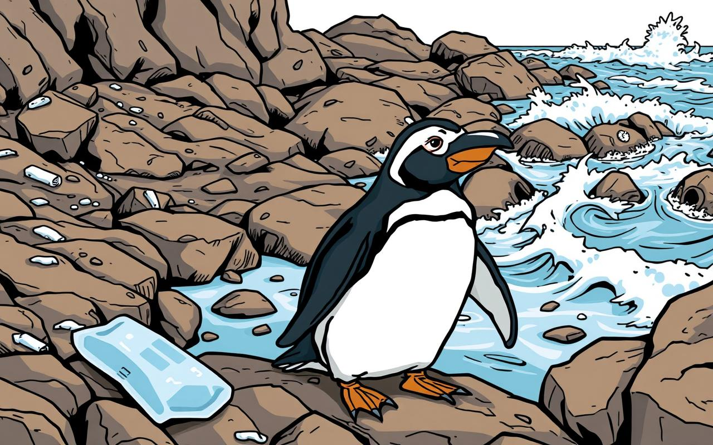
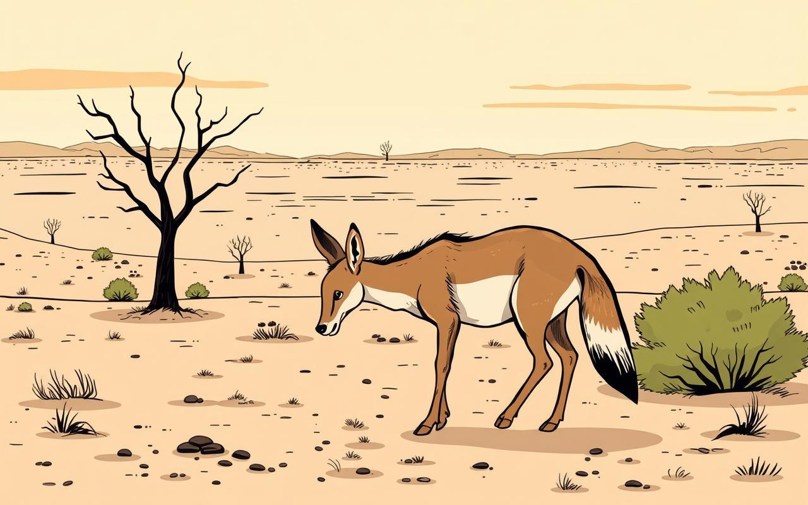
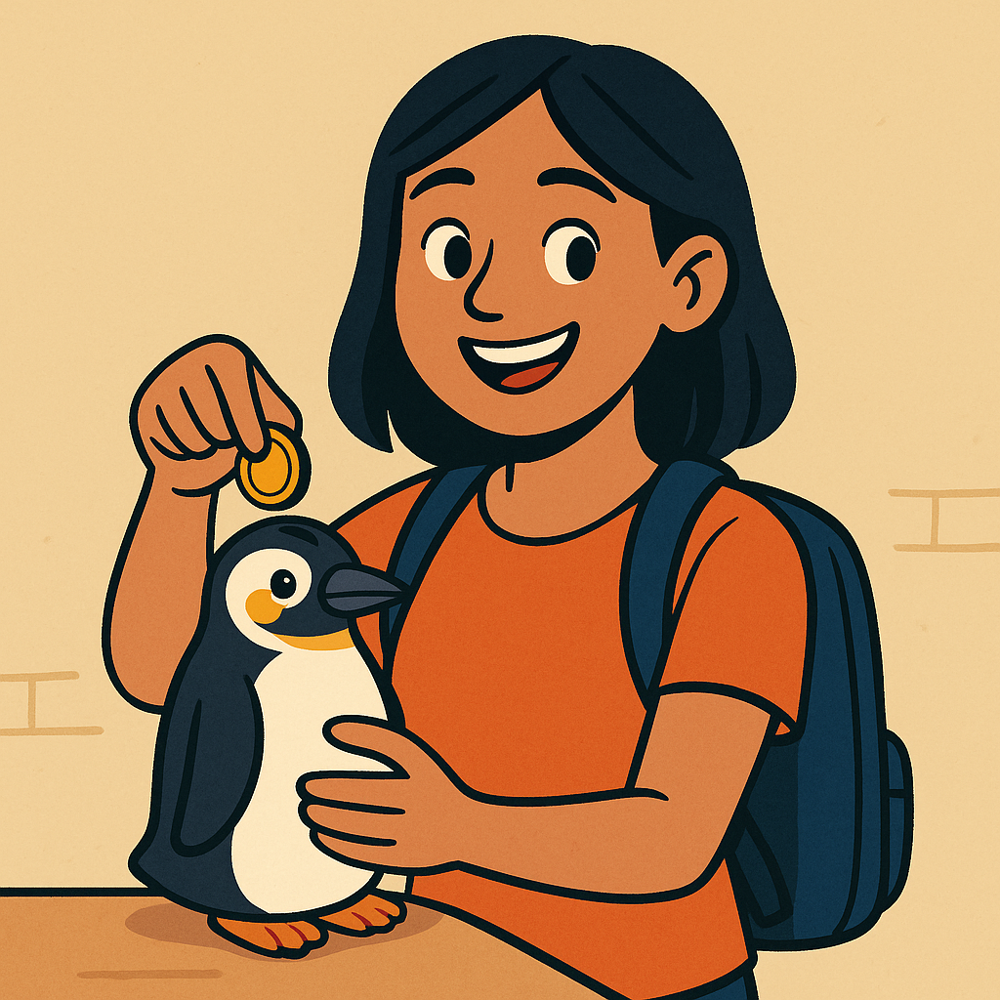

<h1 class="text-4xl font-800 leading-tight" style="font-size:2.0rem; font-weight:800; line-height:1.25; margin: 0 0 0.25rem 0;">
	Conservation runs on sporadic grants and low visibility
</h1>

	<!-- Column 1: Comic-style penguin distress image + caption -->
	

		
		
1 Penguin = 1 GreenCoin

		
1,200 species in Peru are endangered; many lack attention and funding.

	

	<!-- Column 2: Comic-style underfed animal + caption -->
	

		
		
Verification is ongoing and costly (~$300/year), yet incentives for long‑term care are weak.

	

	<!-- Column 3: Provided penguin piggybank asset + video placeholder text under it -->
	

		
		
Missing incentives for long-term care.

	

	We could lose our natural heritage forever

<!-- Source: 4-storyboard/greencoin-board.drawio (Slide 2) with three columns and top badge. -->