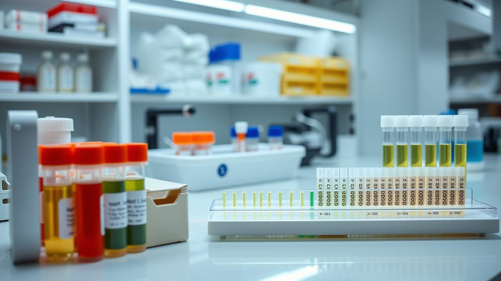

<h1 class="text-4xl font-800 leading-tight" style="font-size:2.25rem; font-weight:800; line-height:1.2; margin: 0 0 0.5rem 0;">
  Green Coin — Proof and how it works
</h1>

  <!-- Left column: Identity & verification steps -->
  

    
1 Penguin = 1 GreenCoin

  

      

        
      

    

  
Identity anchored to DNA

  

      

        
      

    

  
Electrophoresis + Sanger sequencing

  

      

        
      

    

  

  <!-- Middle column: Blockchain / PoA core -->
  

        

      
      PoA
    

    

      Block Chain
      Proof‑of‑Authenticity writes immutable references of reports/media on‑chain.
    

  

  <!-- Right column: PoA and Genealogy outputs -->
  

    

      

  
      

    

  

      

  
      

    

  

<!-- Source: 4-storyboard/greencoin-board.drawio (slide-3) -->
